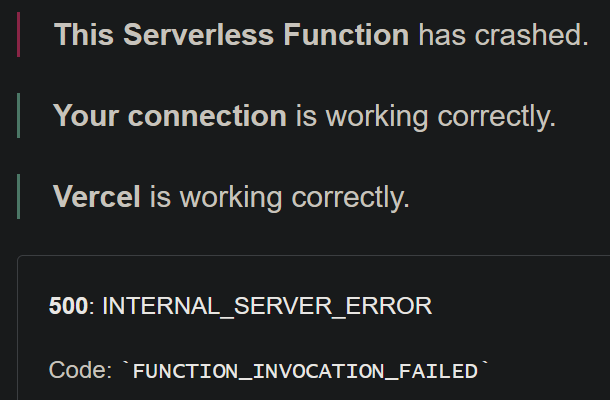

# CNAG: portable port knocker

If badges do not work, badgen is crashing.

## Purpose

This tool allows to issue "port-knocking" sequence for communicating with
programs such as [knockd](https://github.com/jvinet/knock/). The tool is
very simple and can perform only TCP/SYN knocks over IPv4 or IPv6 -- and maybe UDP knocks as well.

**While the tool is written in .NET 6, I have tested it only on Windows. It may
or may not work under Linux and/or macOs.** It seems to work for me on FreeBSD
13.1.

## Installation

[.NET 6 Runtime is required.](https://dotnet.microsoft.com/en-us/download/dotnet/6.0)

To install: `dotnet tool install --global cnag`

You can also compile it from the source which is available
[in the repository.](https://github.com/avysk/cnag)

## Usage

`cnag <my.host.name> <port1> <port2> ...`

You can specify optional delay (in ms) between connection attempts using `-d <delay>` option; the default value is 100 ms.

The tool is silent by default; add `--verbose` option if you wish to see a lot
of messages.

The parameter `-u` (stands for _untested_) switches to UDP mode.

The parameter `-4` allows to force IPv4 usage (by ignoring IPv6 addresses).
